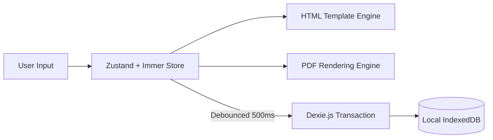

# DoomSSH: The Ultimate Engineering Specification

## 1. Vision & Strategic Rationale
DoomSSH is a high-fidelity, privacy-first resume engineering platform. In an era of data-harvesting SaaS products, DoomSSH provides a "Zero-Trust" alternative where professional-grade document engineering meets local-first data integrity. 

**Engineering Philosophy:**
- **Local-First, AI-Augmented:** Data is a liability; we store zero user data on our servers. AI is treated as a stateless, encrypted utility.
- **Pixel-Perfect Fidelity:** The delta between the web preview and the exported PDF must be zero.
- **Component-Driven Architecture:** Structural logic is decoupled from visual presentation to allow for rapid template expansion.

---

## 2. Technical Architecture & System Design

### 2.1. The "Flow of Truth" (State & Persistence)
DoomSSH implements a sophisticated reactive data loop designed for low-latency editing and guaranteed persistence.



1.  **In-Memory Store:** Zustand manages the active resume tree. `immer` ensures that deeply nested updates (like editing a single bullet in a section) are handled immutably and efficiently.
2.  **Persistence Layer:** Every mutation triggers a debounced flush to IndexedDB. This "Write-Ahead" strategy ensures that application crashes do not result in data loss.
3.  **Hydration:** On mount, the application performs an exhaustive query of IndexedDB to rehydrate the Zustand store.

### 2.2. The Secure AI IPC Bridge
To bypass browser security limitations and protect sensitive API credentials, DoomSSH uses a multi-layered communication bridge.

- **Renderer Process (Untrusted):** Requests AI assistance via `window.electron.aiStream`.
- **Preload Script (Bridge):** Marshals the request and enforces a strict API surface.
- **Main Process (Trusted):** Retrieves the Anthropic API Key from the OS-level Keychain (`safeStorage`), initializes the SDK, and manages the lifecycle of the stream.

### 2.3. The Dual-Path Rendering Engine
This is the system's core innovation. We maintain two synchronized rendering paths:
- **Path A: Interactive HTML/CSS.** Optimized for real-time feedback, drag-and-drop, and fluid typography.
- **Path B: Static PDF (Canvas-like).** Powered by `@react-pdf/renderer`. It generates a binary stream in-browser, ensuring that private resume data is never sent to a rendering server.

---

## 3. Tech Stack Inventory

| Component | Technology | Version | Rationale |
| :--- | :--- | :--- | :--- |
| **Runtime** | Electron | Latest Stable | OS integration & secure storage. |
| **Frontend** | Next.js (App Router) | 16.x | Modern routing & server-side rendering support. |
| **View** | React | 19.x | High-concurrency UI updates. |
| **State** | Zustand + Immer | 5.x / 11.x | Predictable, immutable state transitions. |
| **DB** | Dexie.js | 4.x | Transactional IndexedDB wrapper. |
| **Styles** | Tailwind CSS | 4.x | Build-time CSS variables & ultra-fast styling. |
| **UI** | @base-ui/react | Latest | Accessible, unstyled primitive base. |
| **PDF** | @react-pdf/renderer | 4.x | Declarative PDF construction. |

---

## 4. Engineering Roadmap

### Phase 1: Core Enhancement (Current)
- [x] Multi-column layout support.
- [x] Secure AI streaming integration.
- [x] Dynamic theme engine (Light/Dark).

### Phase 2: Functional Expansion (Soon)
- **Cover Letter Generator:** A dedicated workspace for generating tailored cover letters using resume context.
- **Job Application Tracker:** A local-first Kanban board to manage the application lifecycle.
- **Interview Intelligence:** AI-driven question generation based on specific resume points and job descriptions.

---

## 5. Contribution & Development Protocol

### 5.1. Strict Typing Policy
We use TypeScript not just for safety, but as documentation.
- **Rule:** All interfaces must be defined in `frontend/lib/store/types.ts`.
- **Rule:** Use Discriminated Unions for all polymorphic data types (e.g., Resume Sections).

### 5.2. The "Mirror-World" Contract
**Crucial:** Every change to `frontend/components/templates/MasterTemplate.tsx` **MUST** be replicated in `frontend/components/pdf/ResumePDF.tsx`. If the preview looks different from the export, the PR is invalid.

### 5.3. Local Setup
```bash
# Install root and frontend dependencies
npm install && cd frontend && npm install && cd ..

# Launch development environment (Hybrid)
npm run electron:dev
```

---

**Architect:** Abdallh Mahmood  
**Classification:** Professional-Grade Engineering Tool
