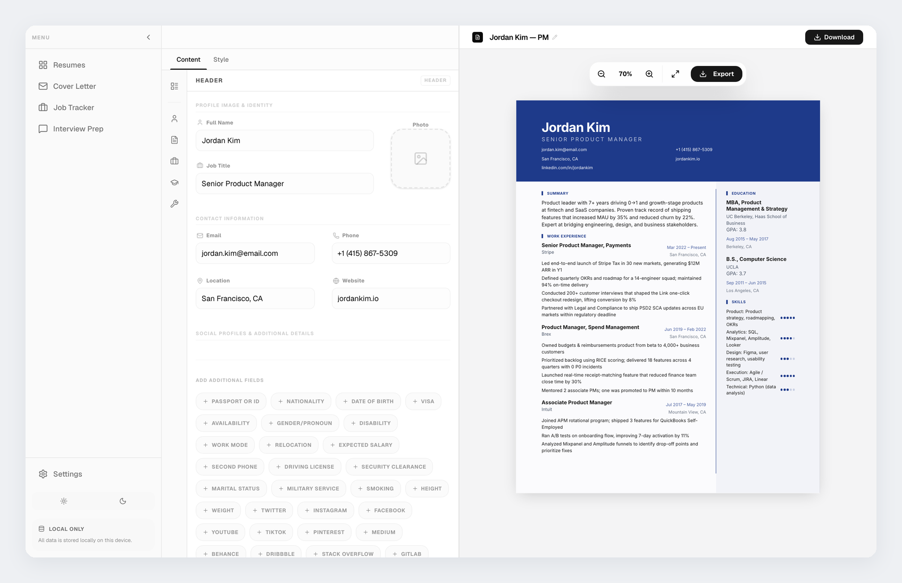
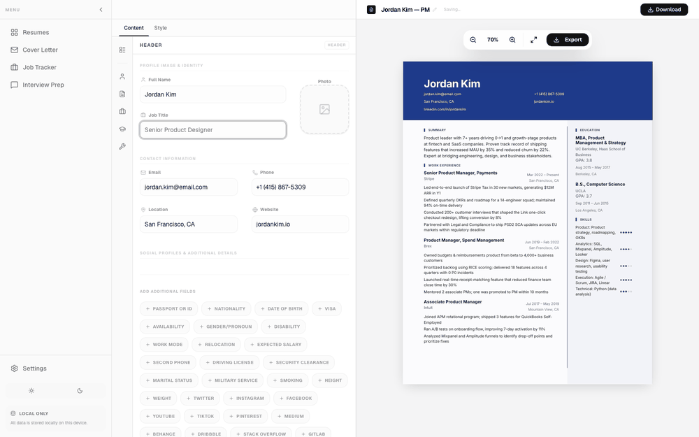
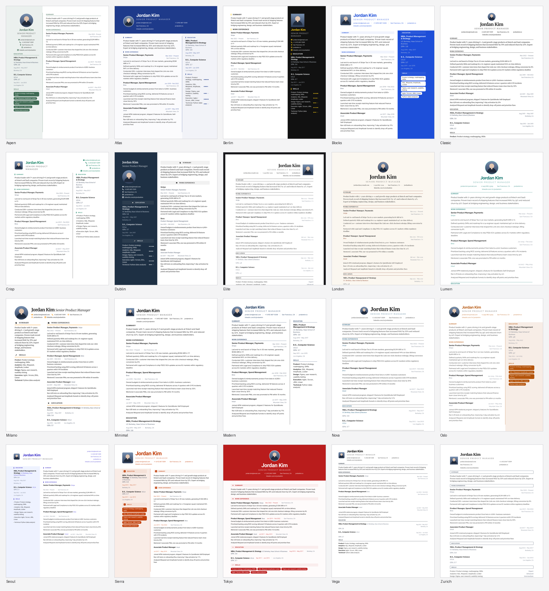
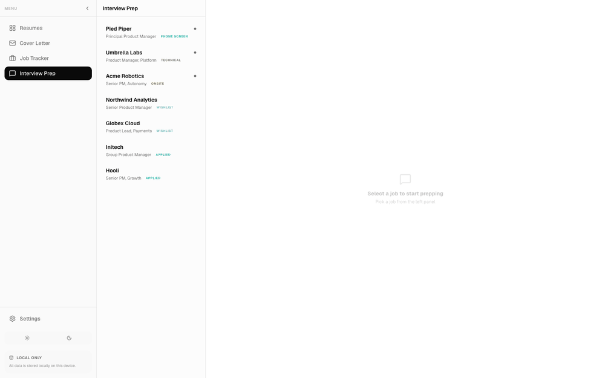
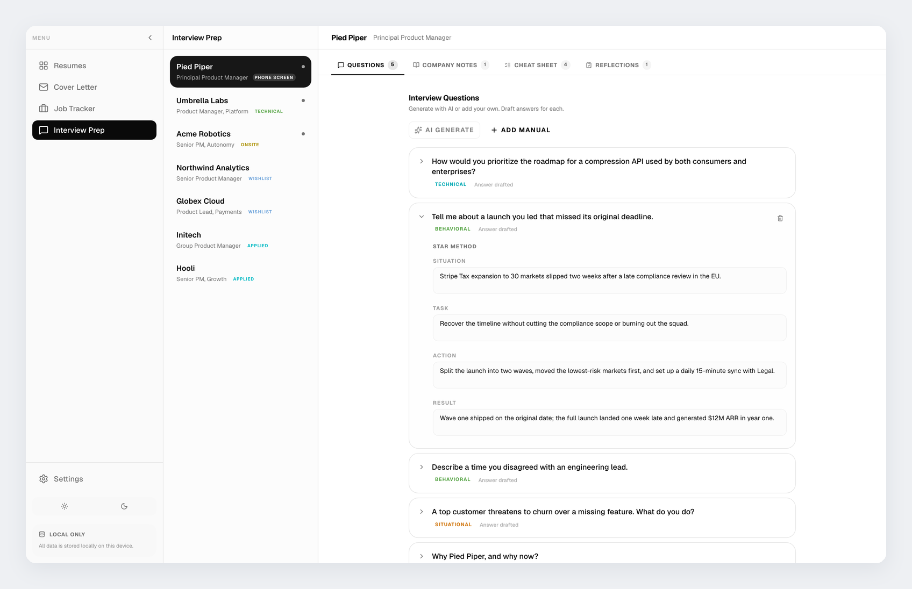
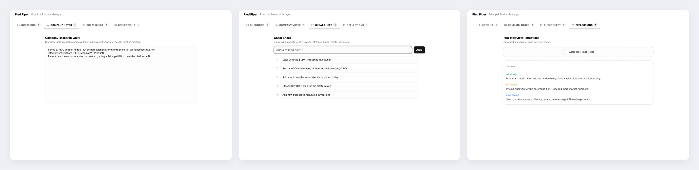
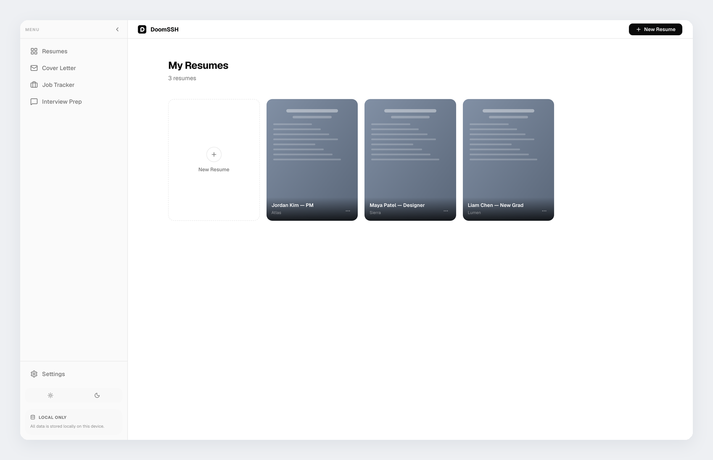
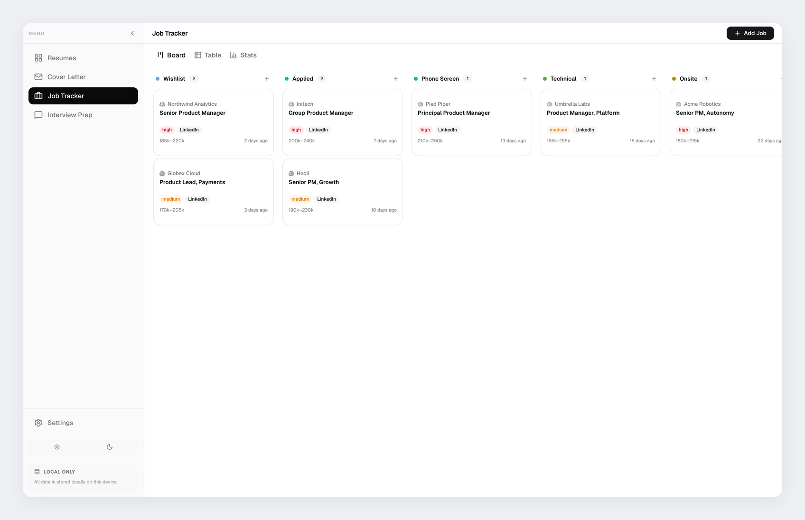
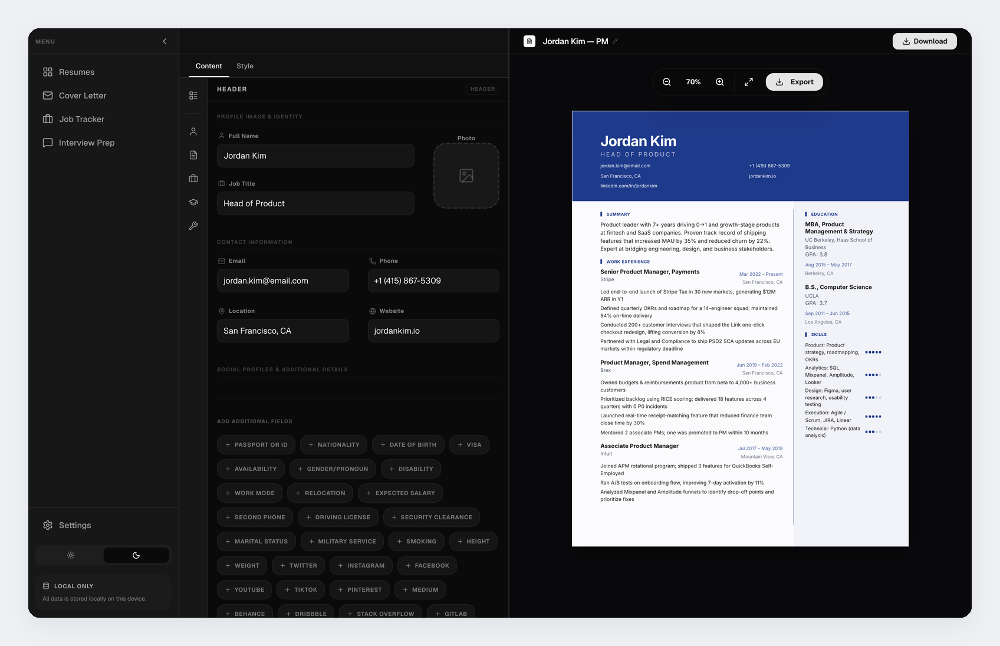

# DoomSSH

> **The AI-Powered, Local-First, Privacy-Focused Resume Builder**
> 
> **Version 1.7.0**

<div align="center">

[](https://opensource.org/licenses/MIT)
[](https://www.electronjs.org/)
[](https://nextjs.org/)
[](https://tailwindcss.com/)

</div>

---

<p align="center">
  
</p>

## Screenshots

### Live preview — edits appear as you type

<p align="center">
  
</p>

### 21 templates, one click apart

<p align="center">
  
</p>

### Interview Prep — questions, STAR answers, notes and reflections per application

<p align="center">
  
</p>

<p align="center">
  
</p>

<p align="center">
  
</p>

<table>
  <tr>
    <td width="50%"><p align="center"><b>Dashboard</b></p></td>
    <td width="50%"><p align="center"><b>Job Tracker</b></p></td>
  </tr>
  <tr>
    <td colspan="2"><p align="center"><b>Dark mode</b></p></td>
  </tr>
</table>

> Screenshots use the fictional sample resumes and job data. Regenerate them from a local build whenever the UI changes.

---

## Why DoomSSH?

Most modern resume builders lock your data behind a subscription or a cloud account. DoomSSH flips the script. It is a professional-grade desktop application — also available in the browser — designed for engineers and creatives who value privacy, performance, and data ownership.

- **Cover Letter Workshop:** A dedicated, modular workspace for crafting narratives. Features proactive AI drafting, tone-shifting tools, and smart resume synchronization.
- **Unified Builder Experience:** A modern, collapsible sidebar provides instant access to your Resumes, Cover Letters, Job Tracker, and Interview Prep from a single interface.
- **What You See Is What You Export:** The live preview is plain HTML that updates as you type, and the desktop app prints that same HTML to PDF with Chromium — no drift between screen and page.
- **Digital Signatures:** Integrated support for uploading and scaling handwritten signatures for a professional finish.
- **Precision Job Tracker:** Link specific resumes and cover letters to your applications to track exactly what story you told to each company.
- **Interview Prep Suite:** For every application, keep interview questions (technical, behavioral, situational), draft behavioral answers with a STAR editor, store company research, pin cheat-sheet talking points and log post-interview reflections. AI question generation is available in the desktop app.
- **Local-First Vault:** Your documents are stored as plain JSON files in a Vault of your choice. No cloud, no tracking, no data harvesting.
- **Runs in the Browser Too:** The same app deploys as a static site. In the browser, everything is saved locally in IndexedDB — still no account and no server.
- **100% Offline Support:** All fonts are bundled locally. The application requires zero internet connection for drafting, designing, or exporting documents.
- **Native Cross-Platform Experience:** Optimized for both macOS and Windows, including native window controls and deep OS integration.
- **Tagged Releases:** Pushing a `v*` tag builds and publishes the macOS and Windows installers; every push to `main` runs the test suite.
- **Transparent Updates:** Built-in software update system with real-time download progress and manual check controls.
- **Bug Mode & Diagnostics:** Built-in diagnostic system ("Bug Mode") in the desktop app to capture and display system errors for easier troubleshooting.
- **Infinite Customization:** 21 professionally designed templates — compact one-pagers, photo sidebars, header bands, creative grids and executive serifs — with deep control over typography, colors, layout mathematics, and section arrangements.

---

## Tech Stack

| Layer          | Technology                                                 |
| :------------- | :--------------------------------------------------------- |
| **Runtime**    | **Electron 34** (Native OS integration & Security)         |
| **Frontend**   | **Next.js 16** (App Router, React 19, Static Export)       |
| **State**      | **Zustand + Immer** (High-performance immutable state)     |
| **Storage**    | **Local Vault** (JSON files) · **IndexedDB** in the browser |
| **Styles**     | **Tailwind CSS 4** + **Base UI** (Atomic, Dark-mode ready) |
| **PDF Engine** | The HTML preview, printed — **Chromium printToPDF** (desktop) · browser **Save as PDF** (web) |
| **AI Bridge**  | **Anthropic SDK** (IPC-streamed for credential safety)     |

---

## Architecture

### The Vault System

DoomSSH treats your resumes as first-class citizens of your file system. By default, it uses a secure system folder, but you can select any directory to act as your Vault. This allows you to:

- **Version Control:** Track changes to your resume using Git.
- **Interoperability:** Open and edit your resume JSON in any text editor.
- **Backup:** Sync your Vault folder via iCloud, Dropbox, or Syncthing.

### IPC Security Boundary

API keys and sensitive operations never touch the untrusted frontend.

1. **Keychain Storage:** Keys are stored in the macOS Keychain or Windows Credential Manager.
2. **Main Process AI:** The Electron Main Process handles Anthropic SDK calls.
3. **Secure Streaming:** AI responses are streamed over secure IPC channels to the renderer.

### Headless Rendering Architecture

To prevent logic drift between the screen and the page, DoomSSH uses a "Headless Controller" pattern. All business logic for a section (formatting, ordering, visibility) is extracted into a single controller in `frontend/lib/renderers/`. Both the HTML and PDF renderers consume a unified `SectionViewModel`.

### HTML → PDF Export

The HTML template (`frontend/components/web/MasterTemplate.tsx`) is the source of truth. The live preview renders it directly, and the desktop app exports it by loading the `/print` page in a hidden window and calling Chromium's `printToPDF` — so the PDF is exactly what you see. Print CSS controls page breaks (headings stay with their content, bullets never split) and repeats margins, sidebar panels and footers on every page. The browser build prints the same page through the browser's print dialog, where you choose **Save as PDF**. See [PDF Export](docs/architecture.md#pdf-export-html--pdf).

### Persistence Manager

State mutations are decoupled from disk I/O. The Zustand stores manage in-memory state only; persistence managers (`frontend/lib/store/persistenceManager.ts`, `jobPersistenceManager.ts`) built on a shared debounced saver write to the Vault — or IndexedDB in the browser — 500 ms after edits pause, and re-save anything that changes while a save is in flight.

---

## Project Structure

```text
doomssh/
├── electron/                    # Main Process
│   ├── main.ts                  # Entry point, IPC handlers, window management
│   └── preload.ts               # Secure bridge to renderer
│   └── resources/               # App icons (icns / ico / png)
├── frontend/                    # Next.js 16 Workspace
│   ├── app/                     # App Router pages
│   │   ├── builder/             # Resume builder UI
│   │   └── print/               # Print page (every PDF export)
│   ├── components/
│   │   ├── web/                 # HTML template — live preview & PDF export
│   │   │   └── sections/        # Section components (DOM)
│   │   ├── preview/             # Live HTML preview panel
│   │   ├── customize/           # Design panel & styling controls
│   │   ├── editor/              # Data entry forms & inputs
│   │   └── jobs/                # Application tracker UI
│   ├── hooks/                   # useResume, useAI, useJobs
│   └── lib/
│       ├── renderers/           # Headless section controllers
│       │   ├── index.ts         # Controller registry
│       │   ├── experience.ts    # Experience logic
│       │   └── types.ts         # ViewModel types
│       ├── store/               # Zustand stores
│       │   ├── resumeStore.ts   # Resume state (source of truth)
│       │   ├── debouncedSaver.ts       # Shared save-after-change logic
│       │   ├── persistenceManager.ts   # Resume saving
│       │   ├── jobPersistenceManager.ts # Job saving
│       │   ├── jobStore.ts      # Job tracker state
│       │   └── uiStore.ts       # UI state (errors, modals)
│       ├── db/                  # Vault via Electron IPC · IndexedDB in the browser
│       ├── pdf/                 # Layout math shared by both renderers
│       └── platform.ts          # Web vs Electron build detection
│   ├── scripts/                 # Template render harness & fixtures
│   └── wrangler.jsonc           # Cloudflare static-asset deployment
├── tests/                       # Playwright E2E & regression tests
└── docs/                        # Architecture & deep-dive docs
```

---

## Getting Started

### Prerequisites

- Node.js (Latest LTS)
- npm or yarn

### Installation

```bash
# Install all dependencies (root + frontend)
npm run install-all

# Start development environment (Next.js + Electron)
npm run dev
```

### Build & Distribution

```bash
# Production build for the desktop app (NEXT_PUBLIC_APP_PLATFORM=electron)
npm run build

# Package for macOS/Windows/Linux
npm run electron:dist
```

The web build deploys to Cloudflare from the `frontend` directory with `NEXT_PUBLIC_APP_PLATFORM=web` set as a build variable. See [Deployment](docs/deployment.md).

---

## Template Customization Guide

DoomSSH offers deep control over every aspect of your resume's appearance. This guide explains how to adjust templates both through the UI and programmatically.

### Available Settings

The following settings can be adjusted via the **Customize Panel** in the builder:

#### Typography

| Setting                    | Options                       | Description                                |
| -------------------------- | ----------------------------- | ------------------------------------------ |
| **Font Family**            | Any Google Font               | e.g., "Merriweather", "Raleway", "Inter"   |
| **Font Size**              | 8–16pt                        | Base body text size                        |
| **Name Size**              | S / M / L / XL                | Scales the candidate's name proportionally |
| **Section Heading Size**   | S / M / L / XL                | Scales section titles                      |
| **Line Height**            | 1.0–2.0                       | Vertical spacing between lines             |
| **Letter Spacing**         | Tight / Normal / Wide         | Horizontal spacing on headings             |
| **Section Capitalization** | Uppercase / Capitalize / None | Transforms section heading text            |

#### Colors

| Setting              | Options          | Description                                           |
| -------------------- | ---------------- | ----------------------------------------------------- |
| **Accent Color**     | Hex color        | Primary brand color (links, headings, decorations)    |
| **Color Mode**       | Basic / Advanced | Basic uses one color; Advanced enables a full palette |
| **Heading Color**    | Hex color        | Color for section titles (Advanced mode)              |
| **Text Color**       | Hex color        | Body text color (Advanced mode)                       |
| **Background Color** | Hex color        | Page background (Advanced mode)                       |

#### Layout

| Setting            | Options                        | Description                              |
| ------------------ | ------------------------------ | ---------------------------------------- |
| **Paper Size**     | Letter / A4                    | Standard North American or international |
| **Margin**         | 10–30mm                        | Page margins                             |
| **Column Layout**  | One Column / Two Columns / Mix | Single-page or sidebar layout            |
| **Column Width**   | 25%–40%                        | Sidebar width in two-column layouts      |
| **Column Reverse** | On / Off                       | Swaps sidebar to the left side           |
| **Entry Spacing**  | Compact / Normal / Spacious    | Vertical gap between resume entries      |

#### Section Display

| Setting                   | Options                                                         | Description                    |
| ------------------------- | --------------------------------------------------------------- | ------------------------------ |
| **Show Section Labels**   | On / Off                                                        | Toggle section headings        |
| **Section Heading Style** | Underline / Overline / Top-Bottom / Box / Background / Left Bar | Decoration style for headings  |
| **Section Heading Icon**  | None / Outline / Filled / Knockout                              | Icon before section headings   |
| **Experience Order**      | Position → Company / Company → Position                         | Which field appears first      |
| **Education Order**       | School → Degree / Degree → School                               | Which field appears first      |
| **Skill Display**         | Compact / Grid / Level / Bubble                                 | How skills are laid out        |
| **Photo**                 | Enable / Disable, Shape, Position                               | Optional profile photo         |
| **Contact Icons**         | None / Outline / Filled                                         | Icon style for contact details |

### Programmatic Template Customization

Templates are **settings presets** (typed by the `ResumeSettings` interface) defined in `frontend/components/web/index.ts`. You can create custom templates by modifying settings programmatically:

```typescript
// Example: Create a "Modern Minimal" template preset
const modernMinimalTemplate = {
  template: "modern-minimal",
  settings: {
    fontFamily: "Inter",
    fontSize: 10,
    nameSize: "M",
    sectionHeadingSize: "S",
    accentColor: "#2563eb",
    colorMode: "advanced",
    headingColor: "#1e293b",
    textColor: "#334155",
    backgroundColor: "#ffffff",
    columnLayout: "one",
    marginHorizontal: 20,
    marginVertical: 15,
    entrySpacing: 1.2,
    lineHeight: 1.4,
    sectionHeadingStyle: "underline",
    sectionHeadingCapitalization: "uppercase",
    showSectionLabels: true,
    experienceOrder: "position-employer",
    educationOrder: "school-degree",
    skillDisplay: "compact",
    dateFormat: "MMM YYYY",
  },
};
```

To add a new template preset:

1. Add the id to the `TemplateId` union in `frontend/lib/shared/types.ts`
2. Add a label and description to `TEMPLATE_META` in `frontend/components/web/index.ts` (the Templates panel lists it automatically)
3. Return the preset's settings from `getTemplateSettings` in the same file

Full walkthrough: [Template Customization Guide](docs/template-customization.md).

### Adjusting Headless Controllers

Section logic (how items are ordered, formatted, and displayed) lives in `frontend/lib/renderers/`. For example, to change how **Experience** entries are rendered:

```typescript
// frontend/lib/renderers/experience.ts

export const experienceController: SectionController = (section, ctx) => {
  const items = (section.items as ExperienceItem[]) || [];
  const { helpers } = ctx;
  const settings = (ctx.settings || {}) as any;

  const processedItems = items.map((item) => {
    const isEmployerFirst = settings.experienceOrder === "employer-title";

    return {
      id: item.id,
      // primaryText = bold/large title
      primaryText: isEmployerFirst ? item.company : item.position,
      // secondaryText = subtitle/label
      secondaryText: isEmployerFirst ? item.position : item.company,
      location: item.location,
      dateRange: helpers.formatDate(
        item.startDate,
        item.endDate,
        item.present,
        settings.dateFormat || "YYYY",
      ),
      description: item.description,
    };
  });

  return {
    title: section.title,
    isVisible: section.visible !== false && processedItems.length > 0,
    type: "experience",
    items: processedItems,
  };
};
```

The **Web renderer** (`frontend/components/web/sections/experience.tsx`) consumes this ViewModel. The live preview and the exported PDF render the same component, so a change to the controller shows up in both.

---

## Testing & Quality

DoomSSH employs a rigorous testing architecture to ensure stability across its dual-renderer system.

- **Automated Test Suite:** Run all tests across Chromium, Firefox, and Webkit.
  ```bash
  npm run test:all
  ```
- **Categories:**
  - `npm run test:e2e`: Main user flows and navigation.
  - `npm run test:regression`: Logic synchronization and state integrity.
  - `npm run test:integration`: Modular UI component coordination.
  - `npm run test:performance`: Render speed benchmarks and load testing.
  - `npm run test:visual`: Visual regression snapshots (Pixel-perfect parity).
- **Unit Testing:** Powered by Vitest for core frontend logic.
  ```bash
  npm run test --prefix frontend
  ```

---

## Documentation

For deeper technical insights, check out the `/docs` directory:

- [Architecture Overview](docs/architecture.md) — System design, rendering pipeline, storage model
- [Frontend Deep-Dive](docs/frontend.md) — Component architecture and state management
- [Electron & IPC Protocol](docs/electron.md) — Main process, preload bridge, and security
- [Template Customization](docs/template-customization.md) — Settings reference, built-in presets, adding templates
- [Deployment](docs/deployment.md) — Cloudflare web build and the platform build variable
- [Troubleshooting](docs/troubleshooting.md) — Builds, PDF export and the browser build
- [Vault Storage Specification](docs/ideas/vault-storage.md) — JSON file format and CRUD operations

---

## License

DoomSSH is open-source software licensed under the [MIT License](LICENSE).

---

<div align="center">
  Built by <strong>Abdallh Mahmood</strong>
</div>
