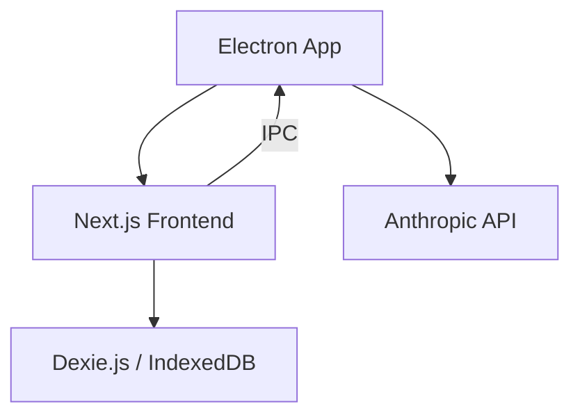

# System Architecture

DoomSSH is built as a modern, decoupled full-stack application with a desktop bridge via Electron.

## Overview

## Data Management

The application employs a local-first storage strategy to ensure responsiveness and data safety:

1.  **Local State (Zustand):** High-frequency UI updates and the active editing state are managed in-memory using Zustand. This ensures that typing and drag-and-drop operations are buttery smooth.
2.  **Local Storage (Dexie.js):** All resume data is mirrored to the browser's IndexedDB via Dexie.js. This allows the application to work offline and ensures that no progress is lost if the tab or app is closed unexpectedly.
3.  **Encrypted Storage (Electron):** Sensitive data like Anthropic API keys and authentication tokens are stored using Electron's `safeStorage` API, ensuring they are protected by the operating system's native credential management.

## Communication

-   **Frontend to AI:** All AI interactions (Claude Opus 4.6) are routed through the Electron Main Process via IPC. This allows for secure storage of API keys and bypasses browser CORS restrictions.
-   **Frontend to PDF:** Client-side PDF generation using `@react-pdf/renderer` primitives ensures that private data never leaves the user's machine for the purpose of rendering.

## Modular Dual-Renderer Architecture

DoomSSH implements a unique "Mirror-World" rendering strategy where the HTML preview and the PDF export are driven by identical, modular logic trees.

### Rendering Paths
1.  **Web Renderer (DOM):** Located in `frontend/components/web/sections/`. Uses Tailwind CSS for high-performance interactive previews.
2.  **PDF Renderer (Vector):** Located in `frontend/components/pdf/sections/`. Uses `@react-pdf/renderer` for high-fidelity vector generation.

### Structural Parity
Every section type (Experience, Education, Skills, etc.) has a dedicated pair of renderer files. This modularity ensures that:
-   **Maintainability:** Changes to a specific section's layout are isolated.
-   **Fidelity:** Visual parity is maintained by updating both renderers simultaneously.
-   **Testing:** Each section can be independently verified for regression and visual consistency.

## Testing Strategy

The project employs a multi-tiered testing architecture managed in the `tests/` directory:

-   **Integration Tests:** Verify the coordination between modular UI components (e.g., the `CustomizePanel`) and the global state.
-   **Regression Tests:** Ensure that state mutations correctly propagate through the dual-renderer pipeline.
-   **Performance Benchmarks:** Measure and enforce strict render-time and page-load thresholds.
-   **Visual Regression:** Automated snapshot comparisons to detect subtle layout shifts across different browser engines.
