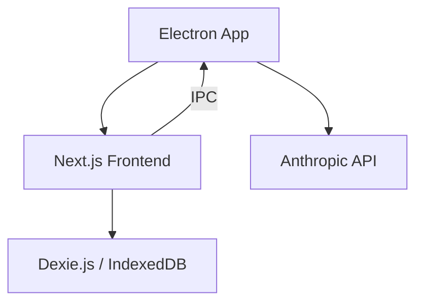

# System Architecture

DoomSSH is built as a modern, decoupled full-stack application with a desktop bridge via Electron.

## Overview

## Data Management

The application employs a local-first storage strategy to ensure responsiveness and data safety:

1.  **Local State (Zustand):** High-frequency UI updates and the active editing state are managed in-memory using Zustand. This ensures that typing and drag-and-drop operations are buttery smooth.
2.  **Local Storage (Dexie.js):** All resume data is mirrored to the browser's IndexedDB via Dexie.js. This allows the application to work offline and ensures that no progress is lost if the tab or app is closed unexpectedly.
3.  **Encrypted Storage (Electron):** Sensitive data like Anthropic API keys and authentication tokens are stored using Electron's `safeStorage` API, ensuring they are protected by the operating system's native credential management.

## Communication

-   **Frontend to AI:** All AI interactions (Claude Opus 4.6) are routed through the Electron Main Process via IPC. This allows for secure storage of API keys and bypasses browser CORS restrictions.
-   **Frontend to PDF:** Client-side PDF generation using `@react-pdf/renderer` primitives ensures that private data never leaves the user's machine for the purpose of rendering.

## Desktop Integration (Electron)

DoomSSH uses Electron to wrap the Next.js frontend into a single executable.
-   **Main Process:** Orchestrates window management, native menus, and lifecycle events. It also acts as a secure proxy for the Anthropic SDK.
-   **Preload Scripts:** Provide a secure bridge between the renderer (Next.js) and the main process, allowing access to file system operations and the AI IPC bridge.
