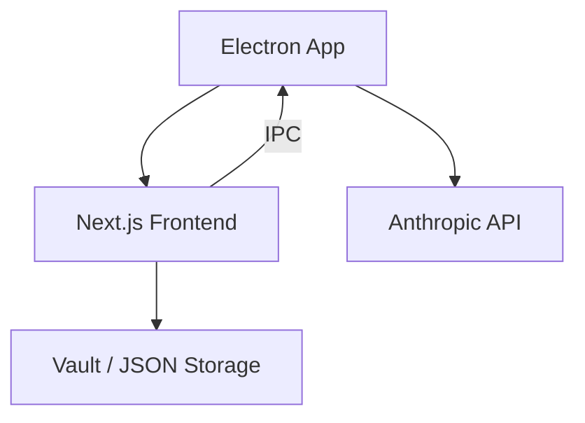
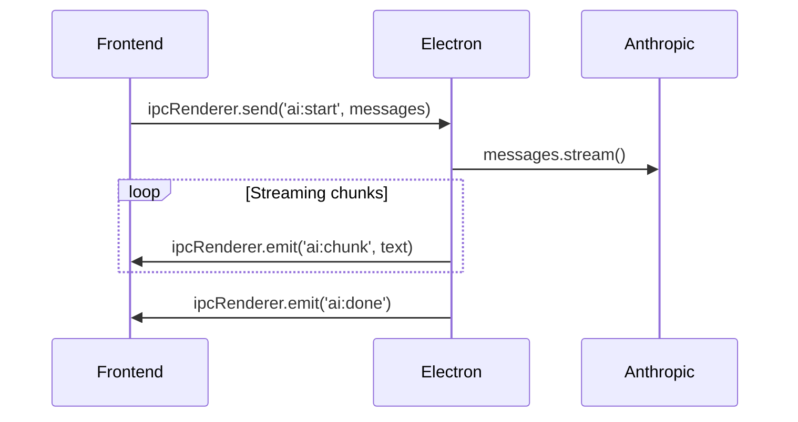

# System Architecture

DoomSSH is a modern, decoupled full-stack application with a desktop bridge via Electron. It combines a local-first data model, a headless rendering pipeline, and a secure AI integration.

## Overview



## Data Management

### Local State (Zustand)

High-frequency UI updates and the active editing state are managed in-memory using **Zustand** with Immer. This ensures that typing, drag-and-drop, and other interactions are buttery smooth.

### Persistence Manager

The Zustand store is intentionally **persistence-agnostic**. A dedicated `PersistenceManager` (`frontend/lib/store/persistenceManager.ts`) subscribes to state changes and debounces writes to the Vault:

```typescript
// frontend/lib/store/persistenceManager.ts
export function initPersistence() {
  useResumeStore.subscribe(
    (state) => state.isDirty,
    (isDirty) => {
      if (!isDirty) return;
      // Debounce 500ms, then write to vault
    }
  );
}
```

This decoupling means:
- The store is easier to test and reason about
- I/O never blocks the main thread
- Saving logic can be swapped without touching the store

### Vault Storage (Electron)

Resume data is stored as **JSON files** in a user-defined or default system directory. By default, the app creates a `vault/` folder inside its user data directory. Users can also select any custom directory.

Sensitive data (Anthropic API keys) is stored using **Electron's `safeStorage` API**, which leverages the OS keychain (macOS Keychain / Windows Credential Manager).

## Communication

### Frontend to AI

All AI interactions (Claude Opus 4.6) are routed through the Electron Main Process via IPC. This bypasses browser CORS restrictions and keeps API keys off the renderer.



### Frontend to PDF

Client-side PDF generation using `@react-pdf/renderer` ensures that private data **never leaves the user's machine** for rendering purposes.

## Headless Rendering Architecture

DoomSSH uses a **Headless Controller** pattern to guarantee perfect visual parity between the interactive HTML preview and the exported PDF.

### The Pipeline

```
Resume Data → Section Controller → SectionViewModel → Renderer (Web / PDF)
```

### 1. Controllers (`frontend/lib/renderers/`)

Each section type has a dedicated controller that:
- Transforms raw store data into a normalized **ViewModel**
- Handles **visibility logic** (e.g., hide section if no items)
- Handles **ordering logic** (e.g., "Employer → Title" vs "Title → Employer")
- Handles **date formatting** via a shared helper

```typescript
// frontend/lib/renderers/types.ts
export interface SectionViewModel {
  title: string;
  isVisible: boolean;
  type: SectionType;
  items: any[];         // Processed, ready-to-render items
  meta?: Record<string, any>;
}

export interface RenderContext {
  settings: any;         // ResumeSettings
  helpers: {
    formatDate: (start, end, present, format) => string;
    pt: (size) => string;
  };
}
```

### 2. Renderers (`frontend/components/web/` & `frontend/components/pdf/`)

Renderers are "dumb" components. They receive a `SectionViewModel` and map it to the appropriate UI framework primitives:

- **Web Renderer** → Tailwind CSS + React DOM
- **PDF Renderer** → `@react-pdf/renderer` vector primitives

### Why This Matters

In a typical dual-renderer setup, you maintain two copies of the same logic. When you change how dates are formatted or how items are ordered, you must update **both** files — and it's easy to miss one.

With the headless pattern, **every business rule lives in exactly one place**. Changing `experienceOrder` from `'position-employer'` to `'employer-title'` requires editing only `experience.ts` in the renderers folder. Both the live preview and the PDF export update automatically.

### Adding a New Section

1. Add the section type to `frontend/lib/store/types.ts` (`SectionType` union)
2. Create a controller in `frontend/lib/renderers/` (or add to `index.ts`)
3. Create a Web renderer in `frontend/components/web/sections/`
4. Create a PDF renderer in `frontend/components/pdf/sections/`
5. Register in both `index.tsx` files (web and pdf section registries)
6. Add editor components in `frontend/components/editor/sections/`
7. Add a data entry form in the Customize Panel if needed

## Testing Strategy

- **Unit Tests** (`frontend/lib/**/*.test.ts`): Vitest tests for controllers, stores, and utilities.
- **Integration Tests** (`tests/`): Playwright tests for UI component coordination.
- **Regression Tests**: Ensure state mutations propagate through the rendering pipeline.
- **Visual Regression**: Automated snapshot comparisons to detect layout drift.

Run all tests:
```bash
npm run test --prefix frontend    # Unit tests
npm run test:all                  # Full suite (requires Playwright)
```
