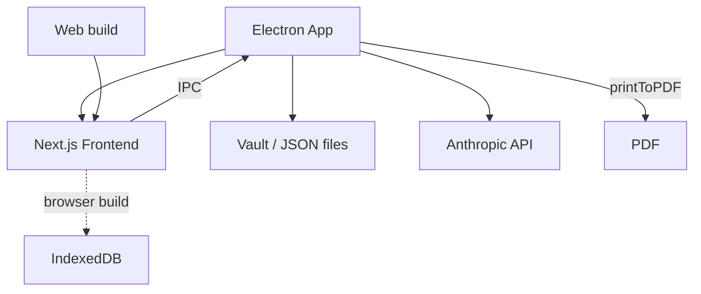
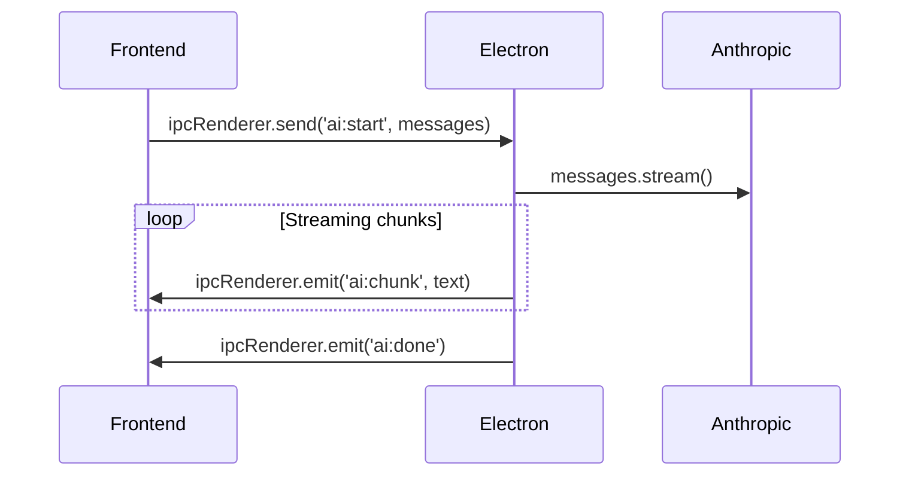
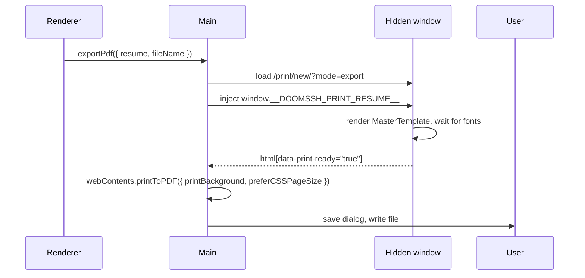

# System Architecture

DoomSSH is a local-first resume builder that ships as two builds from one Next.js codebase: an **Electron desktop app** and a **static web site** (deployed to Cloudflare). It combines a local-first data model, a headless rendering pipeline, and a secure AI integration (desktop only).

## Overview


```mermaid
graph TD
    A[Electron App] --> B[Next.js Frontend]
    B -- IPC --> A
    A --> E[Vault / JSON files]
    A --> F[Anthropic API]
    A -- printToPDF --> P[PDF]
    W[Web build] --> B
    B -. browser build .-> G[IndexedDB]
```

The frontend decides which build it is running in through `frontend/lib/platform.ts` — see [Platform detection](#platform-detection).

## Data Management

### Local State (Zustand)

High-frequency UI updates and the active editing state are managed in-memory using **Zustand** with Immer. This ensures that typing, drag-and-drop, and other interactions are buttery smooth.

### Persistence Manager

The Zustand stores are intentionally **persistence-agnostic**. Two small managers — `frontend/lib/store/persistenceManager.ts` (resumes) and `frontend/lib/store/jobPersistenceManager.ts` (jobs) — are started once by `PersistenceProvider` and built on a shared saver, `createDebouncedSaver` (`frontend/lib/store/debouncedSaver.ts`):

```typescript
// frontend/lib/store/persistenceManager.ts
createDebouncedSaver({
  subscribe: (onChange) => useResumeStore.subscribe((state) => state.resume, onChange),
  getSnapshot: () => useResumeStore.getState().resume,
  isDirty: () => useResumeStore.getState().isDirty,
  save: saveResume,
  onSaved: () => useResumeStore.getState().markSaved(),
  onError: (err) => useUIStore.getState().addError(`Persistence Error: ...`),
});
```

How the saver behaves:
- It watches the **document** (the resume object or the jobs array), not the `isDirty` flag. Every change restarts a 500 ms timer; the save runs when edits pause.
- It only saves when `isDirty` is true, so loading a document never writes it back.
- If the document changes while a save is in flight, it saves again afterwards, and `markSaved()` runs only when nothing changed during the save.
- A failed save leaves `isDirty` true and reports the error to the UI store.

> An earlier version subscribed to `isDirty` and rate-limited saves to one per second. Edits made while the flag was already true — or within a second of the previous save — were silently never written. `tests/lib/store/debouncedSaver.test.ts` covers those cases.

This decoupling means:
- The store is easier to test and reason about
- I/O never blocks the main thread
- Saving logic can be swapped without touching the store

### Vault Storage (Electron)

Resume data is stored as **JSON files** in a user-defined or default system directory. By default, the app creates a `vault/` folder inside its user data directory. Users can also select any custom directory.

Sensitive data (Anthropic API keys) is stored using **Electron's `safeStorage` API**, which leverages the OS keychain (macOS Keychain / Windows Credential Manager).

### Browser Storage (web build)

The web build has no vault. `frontend/lib/db/database.ts` and `frontend/lib/db/jobDatabase.ts` check for `window.electron` and, when it is absent, fall back to **IndexedDB** through Dexie (`frontend/lib/db/browserDb.ts`):

| Table | Key | Holds |
|-------|-----|-------|
| `resumes` | `id` | Resumes and cover letters |
| `kv` | `key` | The jobs file under the key `jobs` |

Data lives only in that browser profile; clearing the site's data deletes it. The database is opened lazily so importing the module never touches IndexedDB during the static prerender.

### Platform detection

`frontend/lib/platform.ts` exposes `appPlatform()`, `isElectron()` and `isWeb()`. The value comes from the build-time variable `NEXT_PUBLIC_APP_PLATFORM` (`web` or `electron`); when it is unset, the platform is detected from the Electron preload bridge (`window.electron`). `next build` inlines the value, so it must be set when building — see [Deployment](./deployment.md).

Use it for behaviour that differs by build (for example, the Settings dialog hides AI, debugging and update controls in the web build). Keep feature checks such as `window.electron?.exportPdf` where you actually call a bridge method.

## Communication

### Frontend to AI

All AI interactions (Claude Opus 4.6) are routed through the Electron Main Process via IPC. This bypasses browser CORS restrictions and keeps API keys off the renderer.


```mermaid
sequenceDiagram
    Frontend ->> Electron: ipcRenderer.send('ai:start', messages)
    Electron ->> Anthropic: messages.stream()
    loop Streaming chunks
        Electron ->> Frontend: ipcRenderer.emit('ai:chunk', text)
    end
    Electron ->> Frontend: ipcRenderer.emit('ai:done')
```

### PDF Export (HTML → PDF)

The HTML template is the single source of truth: the live preview renders it, and the desktop app prints that same HTML with Chromium. Nothing leaves the user's machine.


```mermaid
sequenceDiagram
    Renderer ->> Main: exportPdf({ resume, fileName })
    Main ->> Hidden window: load /print/new/?mode=export
    Main ->> Hidden window: inject window.__DOOMSSH_PRINT_RESUME__
    Hidden window ->> Hidden window: render MasterTemplate, wait for fonts
    Hidden window -->> Main: html[data-print-ready="true"]
    Main ->> Main: webContents.printToPDF({ printBackground, preferCSSPageSize })
    Main ->> User: save dialog, write file
```

- **Entry point:** `downloadResumePDF` in `frontend/lib/utils/export.tsx` calls `window.electron.exportPdf` when the bridge is present.
- **Main process:** the `export-pdf` IPC handler in `electron/main.ts` owns the hidden window, readiness polling (15 s timeout), `printToPDF` and the save dialog.
- **Print page:** `frontend/app/print/[resumeId]/PrintClient.tsx`. With `?mode=export` it takes the injected resume, skips `window.print()`, and sets `data-print-ready` once fonts and layout settle. Without it, it loads the resume by id and opens the print dialog.

**Print CSS** (in `PrintClient`):
- `@page { size: letter | A4; margin: 0 }`. The template's own padding is the page margin, cloned onto every page with `box-decoration-break: clone`, so full-bleed header bands and sidebar panels still reach the paper edge.
- The page root drops its full-page `min-height`, and the last content in each column drops its bottom margin — either one pushes the layout a few pixels past the paper and prints a blank page.
- The sidebar panel and footer become `position: fixed` so they repeat on every page; the footer is inset by the margins and space is reserved for it.
- Page breaks are controlled with data attributes rendered by the web template: `[data-section-heading]` (`break-after: avoid`), `[data-entry]` head (kept with its first line), `[data-entry-desc] > div` (bullets never split) and `[data-keep]` (skills, languages and references print as one block).

**Web build:** a browser cannot print to a file without the print dialog, so the web build still downloads a PDF generated by `@react-pdf/renderer` (`frontend/components/pdf/`). That renderer is kept in step with the HTML template by hand until the web export moves to HTML as well.

## Headless Rendering Architecture

DoomSSH uses a **Headless Controller** pattern to guarantee perfect visual parity between the interactive HTML preview and the exported PDF.

### The Pipeline

```
Resume Data → Section Controller → SectionViewModel → Renderer (Web / PDF)
```

### 1. Controllers (`frontend/lib/renderers/`)

Each section type has a dedicated controller that:
- Transforms raw store data into a normalized **ViewModel**
- Handles **visibility logic** (e.g., hide section if no items)
- Handles **ordering logic** (e.g., "Employer → Title" vs "Title → Employer")
- Handles **date formatting** via a shared helper

```typescript
// frontend/lib/renderers/types.ts
export interface SectionViewModel {
  title: string;
  isVisible: boolean;
  type: SectionType;
  items: any[];         // Processed, ready-to-render items
  meta?: Record<string, any>;
}

export interface RenderContext {
  settings: any;         // ResumeSettings
  helpers: {
    formatDate: (start, end, present, format) => string;
    pt: (size) => string;
  };
}
```

### 2. Renderers (`frontend/components/web/` & `frontend/components/pdf/`)

Renderers are "dumb" components. They receive a `SectionViewModel` and map it to the appropriate UI framework primitives:

- **Web Renderer** → Tailwind CSS + React DOM. Used by the live preview and, through `/print`, by the desktop PDF export.
- **PDF Renderer** → `@react-pdf/renderer` vector primitives. Used only for the web build's PDF download.

### Why This Matters

In a typical dual-renderer setup, you maintain two copies of the same logic. When you change how dates are formatted or how items are ordered, you must update **both** files — and it's easy to miss one.

With the headless pattern, **every business rule lives in exactly one place**. Changing `experienceOrder` from `'position-employer'` to `'employer-title'` requires editing only `experience.ts` in the renderers folder. Both the live preview and the PDF export update automatically.

### Adding a New Section

1. Add the section type to `frontend/lib/store/types.ts` (`SectionType` union)
2. Create a controller in `frontend/lib/renderers/` (or add to `index.ts`)
3. Create a Web renderer in `frontend/components/web/sections/`
4. Create a PDF renderer in `frontend/components/pdf/sections/` (still needed for the web build's download)
5. Register in both `index.tsx` files (web and pdf section registries)
6. If the section should never split across printed pages, add `data-keep` to its root element
7. Add editor components in `frontend/components/editor/sections/`
8. Add a data entry form in the Customize Panel if needed

Controllers must read the field names the editor writes. For example, awards use `title` and `date`, volunteering uses `role`, references use `name` and `position`. `tests/lib/renderers/sections.test.ts` pins these.

## Performance Optimization

DoomSSH employs several strategies to keep editing smooth.

### Debounced Input

Typing in editor fields triggers store updates and persistence. To prevent lag during rapid typing, DoomSSH uses debounced input components:

- **`DebouncedInput`** (`frontend/components/ui/debounced-input.tsx`): Wraps standard inputs with a 500ms debounce delay
- **`DebouncedRichTextArea`** (`frontend/components/ui/debounced-rich-text-area.tsx`): Same for rich text areas

These components maintain local state and only propagate changes to the store after the user stops typing for 500ms.

### Live Preview

The preview (`frontend/components/preview/PreviewPanel.tsx`) renders `MasterTemplate` directly as HTML, so it updates on every store change with no PDF generation, no iframe reload and no lost scroll or zoom position. Zoom is a CSS transform. Dashed "Page N" guides are drawn at each page height; they are approximate, because printing moves a heading or an entry's first line to the next page rather than splitting it.

> The preview used to regenerate a full `@react-pdf` document on every change (debounced) and reload it in an iframe, which caused flicker, scroll resets and noticeable lag.

### Persistence Debouncing

The persistence managers debounce writes (500 ms after the last change) to prevent excessive I/O during editing sessions. See [Persistence Manager](#persistence-manager).

## Testing Strategy

- **Unit Tests** (`frontend/lib/**/*.test.ts`): Vitest tests for controllers, stores, and utilities.
- **Integration Tests** (`tests/`): Playwright tests for UI component coordination.
- **Regression Tests**: Ensure state mutations propagate through the rendering pipeline.
- **Visual Regression**: Automated snapshot comparisons to detect layout drift.
- **Template smoke test** (`frontend/tests/components/web/templateSmoke.test.tsx`): renders the HTML template for every preset and a cover letter, with every section type populated (`frontend/scripts/fixtures.ts`).
- **PDF render harness** (`frontend/scripts/render-templates.tsx`): renders every preset through the `@react-pdf` renderer for inspection. Flags: `--stress` (long, unbreakable content), `--header-sidebar`, `--matrix` (setting combinations no single preset covers) and `--all-sections`. Writes `margins.json` alongside the PDFs for margin checks.

Run all tests:
```bash
npm run test --prefix frontend    # Unit tests
npm run test:all                  # Full suite (requires Playwright)
```
